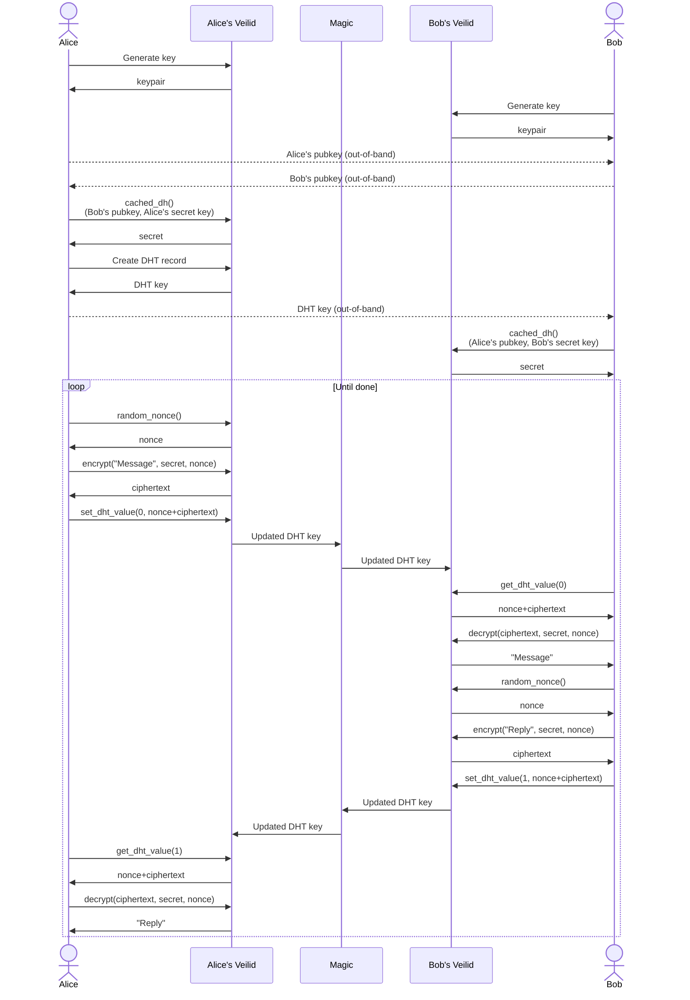

# Foo

bar baz

```mermaid

sequenceDiagram
	actor Alice
	participant Va as Alice's Veilid
	participant Magic
	participant Vb as Bob's Veilid
	actor Bob
	
	Alice ->> Va: Generate key
	Va ->> Alice: keypair
	Bob ->> Vb: Generate key
	Vb ->> Bob: keypair
	Alice -->> Bob: Alice's pubkey (out-of-band)
	Bob -->> Alice: Bob's pubkey (out-of-band)
	
	Alice ->> Va: cached_dh()<br>(Bob's pubkey, Alice's secret key)
	Va ->> Alice: secret
	
	Alice ->> Va: Create DHT record
	Va ->> Alice: DHT key
    
    Alice -->> Bob: DHT key (out-of-band)

	Bob ->> Vb: cached_dh()<br>(Alice's pubkey, Bob's secret key)
	Vb ->> Bob: secret
    
    loop Until done
    	Alice ->> Va: random_nonce()
    	Va ->> Alice: nonce
    	Alice ->> Va: encrypt("Message", secret, nonce)
    	Va ->> Alice: ciphertext
    	Alice ->> Va: set_dht_value(0, nonce+ciphertext)
    	Va ->> Magic: Updated DHT key
    	Magic ->> Vb: Updated DHT key
		Bob ->> Vb: get_dht_value(0)
		Vb ->> Bob: nonce+ciphertext
		Bob ->> Vb: decrypt(ciphertext, secret, nonce)
		Vb->> Bob: "Message"
		
		Bob ->> Vb: random_nonce()
		Vb ->> Bob: nonce
		Bob ->> Vb: encrypt("Reply", secret, nonce)
		Vb ->> Bob: ciphertext
    	Bob ->> Vb: set_dht_value(1, nonce+ciphertext)
    	Vb ->> Magic: Updated DHT key
    	Magic ->> Va: Updated DHT key
    	Alice ->> Va: get_dht_value(1)
    	Va ->> Alice: nonce+ciphertext
    	Alice ->> Va: decrypt(ciphertext, secret, nonce)
    	Va ->> Alice: "Reply"
    end
```
